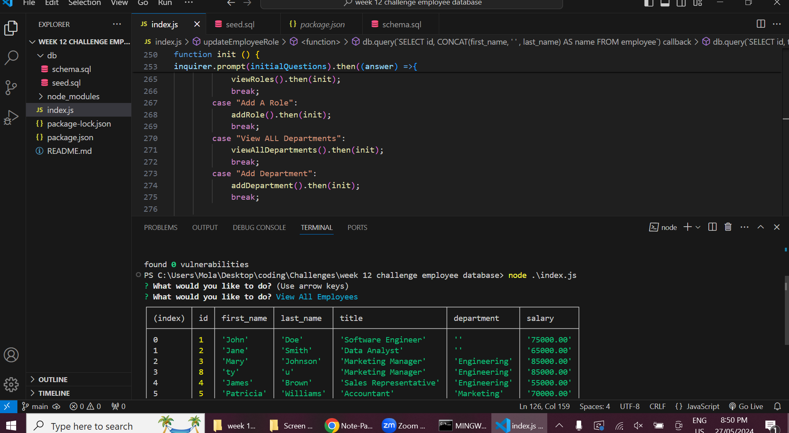

# Employee-Tracker

This application demonstrates an Employee Tracker, a command-line interface designed to manage a company's employee database. Using Node.js, Inquirer, and MySQL, this app allows business owners to view and manage their company's departments, roles, and employees effectively.

## Table of Contents

- [Features](#features)
- [Link-to-Webpage](#Link-to-Webpage)
- [Appearance](#Appearance)
- [About-Developer](#About-developer)
- 

## About-developer

Hello! I'm Molaligne (Mola) Dafa, a dedicated web developer with a passion for reading, understanding how things work, and creating solutions that make the world a better place. My journey into web development stems from a deep curiosity and a strong desire to develop impactful and innovative solutions.

I hold a Full Stack Web Development Certificate from the University of Adelaide. My expertise spans modern web technologies, including Express.js, Node.js, React.js, Tailwind CSS, MySQL/NoSQL, and MongoDB.

## Features

- **View Departments:** Displays a formatted table with department names and IDs.
- **View Roles:** Shows job titles, role IDs, associated departments, and salaries.
- **View Employees:** Provides a formatted table with employee IDs, names, job titles, departments, salaries, and managers.
- **Add Department:** Prompts for a department name and adds it to the database.
- **Add Role:** Prompts for role name, salary, and department, then adds the role to the database.
- **Add Employee:** Prompts for employee's first name, last name, role, and manager, then adds the employee to the database.
- **Update Employee Role:** Allows selecting an employee and updating their role.  
 
  
## Link-to-Webpage
- https://github.com/Mola90/Employee-Tracker

## Appearance

The following image demonstrates a image of the program running
